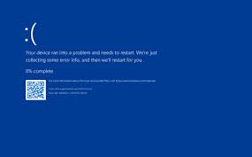

# 🚨Postmortem Report: Windows Blue Screen of Death Incident🚨

## Issue Summary
**Duration of the Outage**⏳
July 19, 2024, from 4:09 AM to 5:27 AM (UTC)
**Impact**🌍 
 The primary service affected was the Windows operating system for users worldwide. This outage impacted both consumers and businesses, including:
- airlines 
- banks 
- health care providers 
- telecommnication companies
- digital billboards. 
About 80% of Windows users experienced system crashes and could ot gain access to their computers with the computers displayonly the Windows blue screen of death.
**Root Cause**🕵️ 
We've got Sherlock Holmes in our software team 😂😂
The root cause was an error emanating from a software update from CrowdStrike, a cybersecurity firm providing antivirus software to Microsoft. The update caused a crucial error in the Windows operating system, leading to the blue screen of death (BSOD).

## Timeline 
- **4:09 AM**: CrowdStrike released a sensor configuration update to Windows systems.
- **4:15 AM**: Issue detected through a monitoring alert indicating a high rate of system crashes.
- **4:20 AM**: Multiple customer complaints received about system crashes and blue screens.
- **4:25 AM**: Initial investigation started by the on-call engineering team.
- **4:40 AM**: Assumed root cause was a potential operating system bug; operating system team notified and began checks.
- **4:50 AM**: Operating system team reported no issues; further investigation focused on recent updates.
- **5:00 AM**: Misleading path taken when logs suggested possible hardware failures; hardware diagnostics performed without resolution.
- **5:10 AM**: Incident escalated to the security software team.
- **5:20 AM**: Security software team identified the recent CrowdStrike update as the potential cause.
- **5:25 AM**: Update from CrowdStrike investigated and confirmed to be the source of the issue.
- **5:27 AM**: CrowdStrike rolled back on the faulty update.🎉
- **5:45 AM**: Monitoring showed a reduction in BSOD occurrences.
- **6:00 AM**: The issue was resolved and users reported successful system restorations 😌😌.

## Root Cause and Resolution
**Root Cause**
🚩 The issue was caused by a faulty sensor configuration update from CrowdStrike. The update triggered a logic error that resulted in a system crash and the blue screen of death (BSOD) on impacted systems. The specific file involved, Channel File 291, controls how Falcon evaluates named pipe execution on Windows systems. That's a major redflag from CrowdStrike company I'd say. I'd hate to be the engineer incharge of fixing this issue clearly had a long day at work.

**Resolution**
The faulty update was remediated by CrowdStrike at 5:27 AM (UTC) on the same day. Users were instructed to restore their systems to a state prior to the update. Additional updates and patches were issued to address any remaining issues caused by the faulty update. No additional changes to Channel File 291 beyond the updated logic were deployed.

## Corrective and Preventative Measures
The fault had to be checked into a correctional facility to fix it behaviour and think of the impacts of its actions on the people.😂
**Improvements**:
The introduce measures to prevent the occurence of such an outage involve
- Prior testing of the the third-party software update before implemenation.
- Implemenation of strict configuration review processes with automated and peer reviews.
- A proper documentation of the the released patch.

I bet using dark mode would prevent your code from having such bugs

